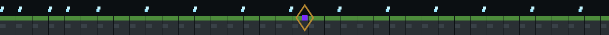
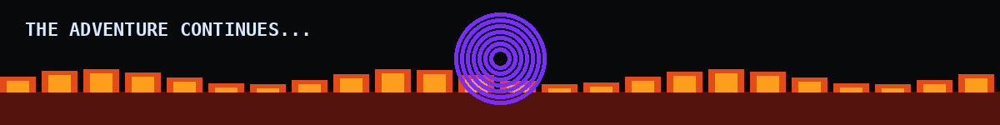

<div align="center">


<br>

<a href="https://github.com/PiyushRouniyar">

</a>
<a href="https://www.linkedin.com/in/piyush-rouniyar-3a0755398">

</a>
<a href="mailto:piyushrouniyarnepal@gmail.com">

</a>

<br><br>


<br>


</div>



## ⛏️ PLAYER PROFILE

**Piyush Rouniyar** · Computer Science Student · Builder

I like taking an idea from:

`CRAFT → BUILD → TEST → DEPLOY`

I work across **full-stack development, AI/ML, data and product engineering**.

> **If I can imagine it, I want to build it.**


## 🧱 MY INVENTORY

<div align="center">


<br><br>

`Python` `TypeScript` `JavaScript` `Next.js` `React` `Flask` `PostgreSQL` `Prisma` `Firebase` `Supabase` `Gemini` `Unity`

</div>


## 🗺️ MY WORLD

### 🟩 PlateFlow
**Restaurant SaaS**

QR menus · customer ordering · restaurant dashboard · AI menu import · real-time orders · billing · analytics

`Next.js` `TypeScript` `PostgreSQL` `Prisma` `Supabase` `Gemini`

**Status:** `LIVE • V1`

---

### 🥕 AI Food Analysis
Point the camera at food → get **AI-powered nutritional insights**.

`Python` `Flask` `Gemini` `Firebase`

---

### 🏙️ Urban Flow
A 3D smart-city traffic simulator with **vehicle AI, traffic lights, CCTV, pedestrians and congestion detection**.

`Unity` `C#` `URP`

---

### 🏠 GharSetu
A hyperlocal marketplace connecting local sellers with nearby customers.

`JavaScript` `Firebase`

---

### 🧠 Mind Mess
A chaotic AI experiment that turns random thoughts into ridiculous responses.

`Python` `Gemini API` `JavaScript`


## 🏆 ACHIEVEMENTS

| Achievement | Quest |
|---|---|
| 🏆 **Winner — IIC Quest 4.0** | Built CivicChain Nepal during a 36-hour hackathon |
| 🚀 **PlateFlow** | Built and deployed a restaurant SaaS product |
| 🤖 **AI Builder** | Built multiple Gemini-powered applications |
| 🎮 **Game Developer** | Built an interactive 3D traffic simulator |


## 🌌 CURRENT QUEST

```yaml
learning:
  - Artificial Intelligence
  - Machine Learning
  - System Design
  - Advanced Full-Stack Development

building:
  - AI-powered products
  - SaaS applications
  - Real-world software

exploring:
  - Generative AI
  - Multimodal AI
  - Product Engineering

open_to:
  - Internships
  - Collaborations
  - Hackathons
  - Open Source
```


## 📊 WORLD STATISTICS

<div align="center">


</div>


## 💚 CONNECT

<div align="center">

[**GitHub**](https://github.com/PiyushRouniyar)
&nbsp; • &nbsp;
[**LinkedIn**](https://www.linkedin.com/in/piyush-rouniyar-3a0755398)
&nbsp; • &nbsp;
[**Email**](mailto:piyushrouniyarnepal@gmail.com)

<br><br>



### `THE WORLD IS YOURS TO BUILD.`

</div>
