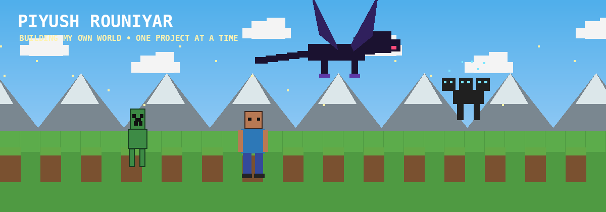
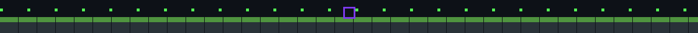

  

  

<table width="100%">
<tr>
<td width="30%" valign="top" align="center">

## ⛏️ PLAYER

**Piyush Rouniyar**

`FULL-STACK & AI ENGINEER`

📍 Nepal

 

**SPECIALIZATION**  
`SOFTWARE & AI SYSTEMS`

 

**OPEN TO**  
Software Roles • Collaborations  
Hackathons • Open Source

 

</td>

<td width="70%" valign="top">

## 🌳 SKILL TREE

 

</td>
</tr>
</table>

## 🗃️ FEATURED PROJECTS

<table width="100%">
<tr>
<td width="50%" valign="top">

### 🟩 PlateFlow

Restaurant SaaS for QR menus, ordering, management, AI menu import, real-time orders and analytics.

`Next.js` `TypeScript` `PostgreSQL` `Prisma`

</td>
<td width="50%" valign="top">

### 🥕 AI Food Analysis

Food image → AI nutritional analysis, calories, macros and food history.

`Python` `Flask` `Gemini` `Firebase`

</td>
</tr>
<tr>
<td width="50%" valign="top">

### 🏙️ Urban Flow

3D smart-city traffic simulator with vehicle AI, traffic lights, CCTV and pedestrian systems.

`Unity` `C#` `URP`

</td>
<td width="50%" valign="top">

### 🏠 GharSetu

Hyperlocal marketplace connecting local sellers with nearby customers.

`JavaScript` `Firebase`

</td>
</tr>
</table>

## 🐍 CONTRIBUTION SNAKE

  

  

